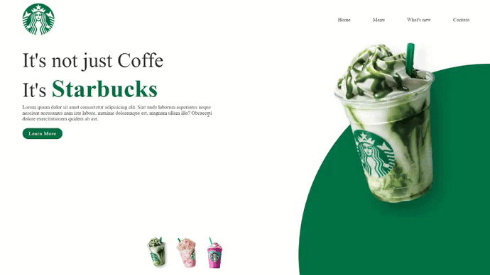

# Landing Page Starbucks

Esta é uma landing page fictícia para o Starbucks, criada utilizando a tecnologia React.

  

## Visão Geral

Essa landing page foi desenvolvida como parte de um projeto de prática para aprimorar as habilidades em React. O objetivo era criar uma página de destino para o Starbucks, utilizando componentes reutilizáveis e boas práticas de desenvolvimento.

## Tecnologias Utilizadas

- React
- HTML
- CSS

## Instalação

1. Clone este repositório: `git clone https://github.com/CarlosDanielMoura/starbucks-landing-page.git`
2. Acesse o diretório do projeto: `cd starbucks-landing-page`
3. Instale as dependências: `npm install`

## Como Usar

1. Inicie o servidor de desenvolvimento: `npm start`
2. Acesse a aplicação no navegador: [http://localhost:3000](http://localhost:3000)

## Contribuição

Contribuições são bem-vindas! Se você quiser contribuir com melhorias, correções de bugs ou novos recursos, siga os passos:

1. Faça um fork deste repositório
2. Crie uma branch para a sua feature: `git checkout -b feature-nova`
3. Faça commit das suas mudanças: `git commit -m 'Adiciona nova feature'`
4. Faça push para a branch: `git push origin feature-nova`
5. Abra um Pull Request

## Licença

Este projeto está licenciado sob a [Licença MIT](LICENSE).

---

**Nota:** Esta landing page é fictícia e foi criada apenas para fins educacionais e de demonstração.

Criado por Carlos Daniel de Moura Santos - [GitHub Profile](https://github.com/CarlosDanielMoura).
